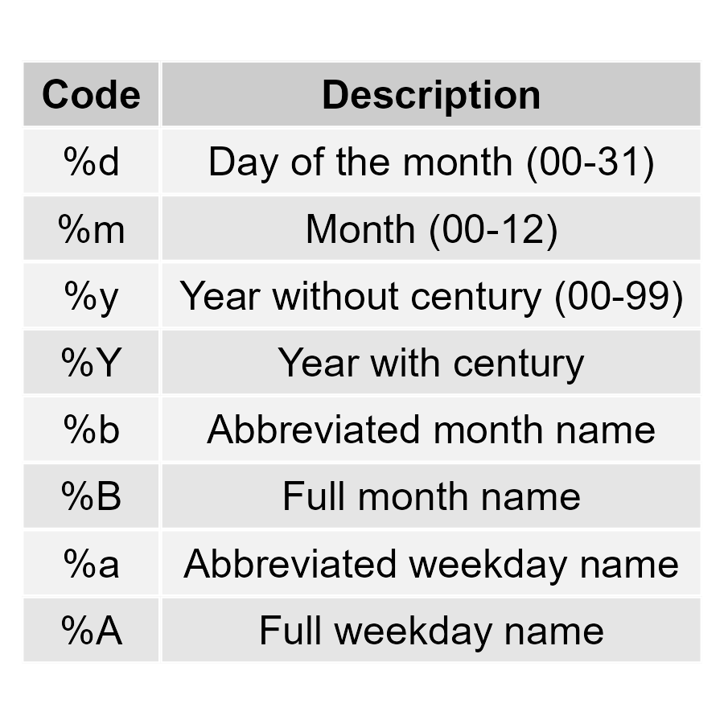

# Packages

```{r}
pacman::p_load(tidyverse, here)
```

# Data: Childhood diarrheal diseases in Mali

We will use the `malidd` data frame, which we've seen in previous lessons.

```{r}
# Load data from CSV
malidd <- read_csv(here::here("data/malidd.csv"))

# Inspect dataframe
malidd %>% head()
```

```{r}
# Look at data classes of each variable
glimpse(malidd)
```

Note that `read_csv()` (a dplyr function) has recognized the `admit_date` column from our CSV as a variable of class "date". If we used `read.csv()` (a base R function) would read it as class "character". This is one example of how tidyverse functions are more intuitive than base R.

```{r}
summary(malidd)
```

We have lots of numeric variables that could be visualized with histograms. We also have a date variable that could be used for a time series line graph.

# Time series plot with `geom_line()`

Let's create a line graph to look at the number of admissions per day, over the time period of this study.

## Basic time series line graph with summarized data

Create a time series plot by first summarizing the data to count the number of admissions for each date, then plot the summary data using `geom_line()`.

```{r}
# Summarize data
"WRITE YOU CODE HERE"

# Create a line plot using the summarized data
"WRITE YOU CODE HERE"
```

## Time Series Plot using geom_line() with stat = "count"

Alternatively, ggplot2 allows us to avoid manual data summarization by using the `stat = "count"` argument in `geom_line()`. This automatically counts the number of admissions for each date and plots the line.

```{r}
# Create a line plot using stat = "count"
ggplot(malidd, aes(x = admit_date)) +
  geom_line(stat = "count")

```

## Customizing X-axis Tick Labels in Time Series Plots

When you plot dates, sometimes the default tick labels on the axis may not be ideal. You can customize the axis tick labels using `scale_x_date()`.

To customize the frequency of labels, use `date_breaks`:

```{r}
ggplot(malidd, aes(x = admit_date)) +
  geom_line(stat = "count") +
  scale_x_date(date_breaks = "2 months")
```

To customize the format of the dates, use `date_labels`:

```{r}
ggplot(malidd, aes(x = admit_date)) +
  geom_line(stat = "count") +
  scale_x_date(date_breaks = "2 months", date_labels = "%B")
```

When customizing date formats in ggplot2, we use specific codes to represent various components of a date. Here are some common codes that you can give to `date_labels`:



Change the axis ticks labels on the previous line graph to display abbreviated labels every month.

```{r}
"WRITE YOU CODE HERE"
```


# Kernel density estimation

Here's a histogram looking at the distribution of a numerical variable, `muac_cm`. MUAC stands for middle-upper arm circumference, and is measured in centimeters.

```{r}
# Draw histogram of MUAC with black outline, white fill, and bin width of 0.5
"WRITE YOU CODE HERE"
```

This distribution can also be visualized with a kernel density plot, which is an alternative to histograms.

{width="476"}

The `geom_*()` function used to create these is called `geom_density()`. Replace `geom_histogram()` with `geom_density()` to show the smoothed distribution of `muac_cm`:

```{r}
# Density curve
ggplot(data =  malidd , 
       mapping = aes(x = muac_cm)) +
  geom_density()
```

Similarly to histograms, kernel density plots also accept fixed aesthetics like `color` and `fill`. Since there are no bins, we cannot adjust those.

```{r}
# Add color and fill
ggplot(data =  malidd , 
       mapping = aes(x = muac_cm)) +
  geom_density(colour="black",
    fill = "white")
```

Now the area beneath the curve is colored in.

# Histogram with kernel density estimation

Kernel density plots give us a high-level overview of the distribution, but we might want to see them alongside more fine scale data that histograms provide. Often we we do this by displaying both on the same plot. 

Similarly to how we combined geometrical layers in the past (scatter plots overlaid with a smoothing curve, and line graphs overlaid with points), we can put a density plot over a histogram.

In order to overlay a kernel density estimate over a histogram in ggplot2 you will need to add `aes(y = after_stat(density))` to `geom_histogram` and add `geom_density` as in the example below.

```{r}
# Histogram overlaid with kernel density curve

ggplot(data =  malidd , 
       mapping = aes(x = muac_cm)) +
  geom_histogram(fill = "steelblue",
                 color = "white",
                 bins = 25, 
                 boundary = 2,
                 mapping = aes(y = after_stat(density))) +
  geom_density()
```

## Comparing distributions

Now say we want to split each bar of the histogram by categorical variables in `malidd`, like `sex`. 

You can create a simple stacked histogram of MUAC by setting the `fill` parameter to sex.

```{r}
ggplot(data =  malidd , 
       mapping = aes(x = muac_cm, 
                     fill = sex)) +
  geom_histogram()
```
### Position adjustments

After setting fill color, you can change the position adjustment within `geom_histogram()`.


Possible values for the argument **position** in `geom_histogram()` are `“identity”`, `“stack”`, `“dodge”`. Default value is `“stack”`.

```{r}
# stack: stacked distributions of a categorical variable  
ggplot(data =  malidd , 
       mapping = aes(x = muac_cm, 
                     fill = sex,
                     color = sex)) +
  geom_histogram(alpha = 0.4, 
                 position = "stack") + 
  ggtitle("position = 'stack'")
```


```{r}
# identity: draw overlapping distributions on the same plot
ggplot(data =  malidd , 
       mapping = aes(x = muac_cm, 
                     fill = sex,
                     color = sex)) +
  geom_histogram(alpha = 0.4, 
                 position = "identity") + 
  ggtitle("position = identity")
```


```{r}
# dodge: interweave distributions on the same plot
ggplot(data =  malidd , 
       mapping = aes(x = muac_cm, 
                     fill = sex,
                     color = sex)) +
  geom_histogram(alpha = 0.4, 
                 position = "dodge") + 
  ggtitle("position = 'dodge'")


```

# Position adjustments for KDEs

Now it's your turn! Apply position adjustments to KDE plots. 

We'll first create a new categorical variable called **`age_group`**.

```{r}
# Create new variable with 3 age groups
malidd <- malidd %>% 
  mutate(age_group = case_when(
    age_months <= 3 ~ 'newborn',
    age_months > 3 & age_months <= 12 ~ 'infant',
    age_months > 12 & age_months <= 48 ~ 'toddler'))
```

Set `fill` to age group, and compare distributions between age groups using `position` arguments. 

Try to come up with 3 different plots.

```{r}
ggplot(data =  malidd, 
       mapping = aes(x = height_cm, fill = age_group)) +
  geom_density(alpha = 0.4, position = "stack")

ggplot(data =  malidd, 
       mapping = aes(x = height_cm, fill = age_group)) +
  geom_density(alpha = 0.4, position = "identity")
```

